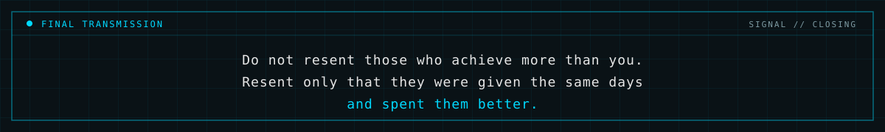

 

 

Full stack software developer building with AWS, Python, React, Angular, and automation. Focused on trading systems, internal tools, scalable web products, and mobile app development.

 

 

 

 

 

 

 

 

&nbsp;&nbsp;

