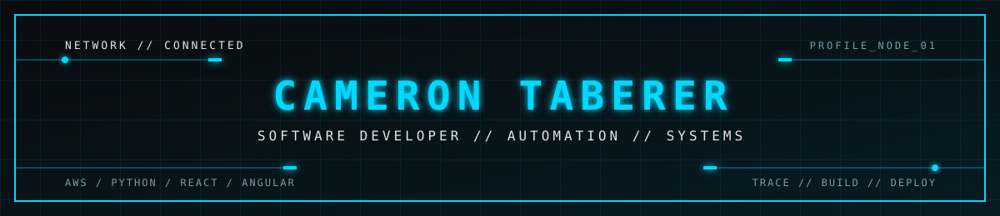
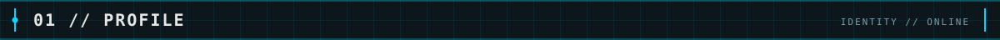
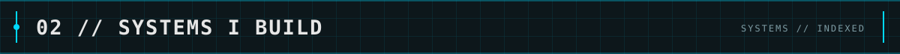
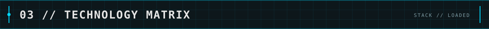
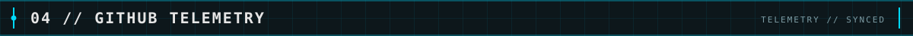
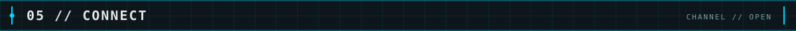

<div align="center">

<br />

</div>



Software developer building with AWS, Python, React, Angular, and automation. Focused on trading systems, internal tools, and scalable web products.



<div align="center">

</div>



<div align="center">

</div>

<br />
<br />



<div align="center">


<br />

</div>



<p align="center">
  <a href="https://github.com/cameron-taberer"></a>
  <a href="https://www.linkedin.com/in/cameron-taberer"></a>
</p>

<div align="center">

```text
"The impediment to action advances action.
 What stands in the way becomes the way."
                                          — Marcus Aurelius
```

</div>
